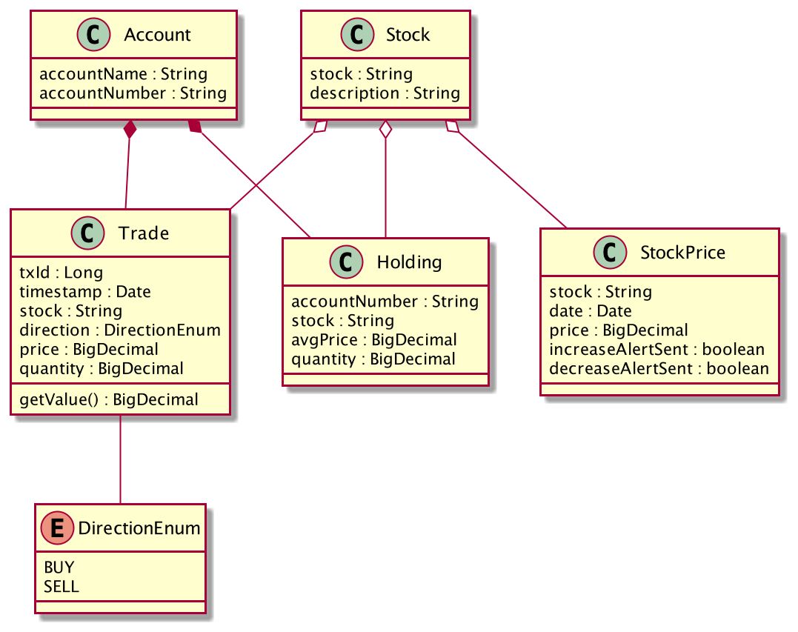

# Portfolio Tracker Service

## Problem Statement

As a user invested in multiple stocks and tradeable equities, need a tool to track stock purchases/holdings/liquidation. The user should be notified if there is a significant daily drop in a specific equity ( say > 10% ) or overall portfolio. Design a a backend system that handles the data input, stock feeds, jobs and alerting. You may choose to implement one or more API or Job implementation depending on the time available. Please choose a implementation that works for you Development environment even though that is not what you might have designed for.

## Use Cases

Following use cases need to be considered to understand the requirement better.

1. One page view of the portfolio summary showing total of current holdings and purchase values (cost basis)
2. Reflect purchase of new stocks
3. Reflect liquidation of some stocks
4. Alert on big move as defined (> 10% )

# Implementation

## Simplified Domain Model

